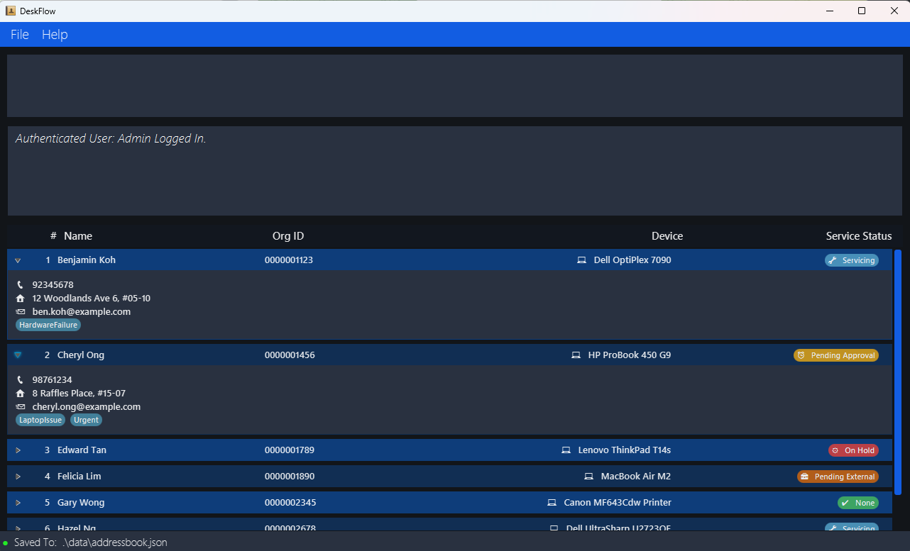

# DeskFlow

## Overview

DeskFlow is an enterprise focused contacts and asset management platform for IT helpdesks anywhere. Focusing on safety, security, reliability and an intuitive command-line first UI, DeskFlow will help bring flow to your IT helpdesk.

## Getting Started

For detailed documentation of the project, see the **[DeskFlow Product Website](https://ay2425s2-cs2103t-t10-2.github.io/tp/)**.

## CS2103T Project Information

- The project simulates an ongoing software project for a desktop application (called _AddressBook_) used for managing contact details.
  - It is **written in OOP fashion**. It provides a **reasonably well-written** code base **bigger** (around 6 KLoC) than what students usually write in beginner-level SE modules, without being overwhelmingly big.
  - It comes with a **reasonable level of user and developer documentation**.
- This project is a **part of the se-education.org** initiative. If you would like to contribute code to this project, see [se-education.org](https://se-education.org/#contributing-to-se-edu) for more info.

## References

This project is based on the AddressBook-Level3 project created by the [SE-EDU initiative](https://se-education.org).