DeskFlow is a powerful desktop application built for IT helpdesk staff to streamline the management of contact
information of employees, track device information, and keep track of service events. For the tech-savvy, DeskFlow is
optimized for use via a Command Line Interface (CLI), while also featuring a
well-designed, easy to use Graphical User Interface (GUI), making it easy to use for anyone.

--------------------------------------------------------------------------------------------------------------------

* Table of Contents
{:toc}

--------------------------------------------------------------------------------------------------------------------

## Quick start

This quick start will walk you through installing DeskFlow and its dependencies, running the application,
registering a new account and logging in. You will also learn how to use the DeskFlow UI and CLI, with some examples.
If you're an experienced user, you may wish to skip to the [Features](#features) section.

### Installation

<div markdown="span" class="alert alert-info">:bulb: **Tip:**
For experienced users, the latest release of DeskFlow is available as a `.jar`
file  [here](https://github.cob/AY2425S2-CS2103T-T10-2/tp/releases),
or you may wish to build the project from [source](https://github.com/AY2425S2-CS2103T-T10-2/tp). Ensure you have
Java `17` installed.
</div>

#### Step 1. Install Java `17` or Above

##### Windows / Linux

Most Windows and Linux distributions come with Java pre-installed. To verify if you have a compatible version of Java,
open a Command Prompt on Windows, or a terminal
on Linux, and run the command `java -version`. You should see an output similar to either of the following:

```bash
java version "17.0.1" 2021-10-19 LTS
openjdk version "17.0.14" 2025-01-21
```

If you do not have Java installed, or if you have a version lower than `17` you may follow the installation
instructions for Windows [here](https://se-education.org/guides/tutorials/javaInstallationWindows.html), and
Linux [here](https://se-education.org/guides/tutorials/javaInstallationLinux.html).

##### Mac OS

You must follow the instructions  [here](https://se-education.org/guides/tutorials/javaInstallationMac.html) to
install a specific version of the Java Development Kit (JDK).

To verify a successful installation, open a terminal and run the command `java -version`. You should see an output
similar to the following:

```bash
java version "17.0.14.fx-zulu" 2021-10-19 LTS
```

#### Step 2. Download DeskFlow

DeskFlow is available as a Java ARchive (JAR) file, terminating in `.jar`. Install the JAR file from our latest
release [here](https://github.com/AY2425S2-CS2103T-T10-2/tp/releases).

#### Step 3. Creating a DeskFlow Home Folder

A home folder is the directory where the DeskFlow application's `.jar`, as well as your data files, will be stored.
We recommend creating a new folder in your home directory called `DeskFlow` for this purpose. Copy the previously
downloaded `DeskFlow.jar` file into this folder.

### Running DeskFlow

Ensure that you have followed steps 1-3 from the installation before proceeding.

1. On Windows, open a command prompt, and on macOS/Linux, open a terminal. Run the command `cd <path_to_home_folder>`,
   substituting `<path_to_home_folder>` with the path to the folder you created in *Step 3* of
   the installation.
2. Run the command `java -jar DeskFlow.jar`.
3. A window similar to the following should appear. While you'll learn more about the Ui later in this guide, you
   should know about the command input box (highlighted in red), where you can enter commands to interact with DeskFlow.
   The command result box (highlighted in orange) will display the result of the command you entered.

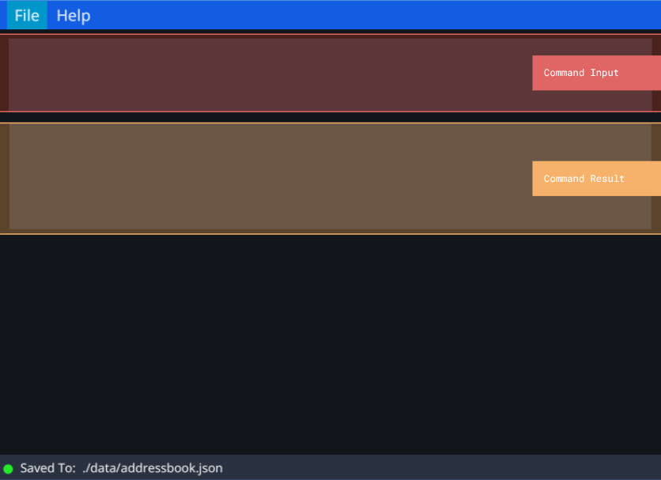

### Registering and Logging In

Since you're using DeskFlow for the first time, you will need to register an account before you can log in.

1. Type the command `register` into the command input box. A pop-up similar to the following should appear. Enter a
   suitable, non-empty username and password, and click the `Register` button. If successful, you should see a
   message `New user added.` in the command result box.

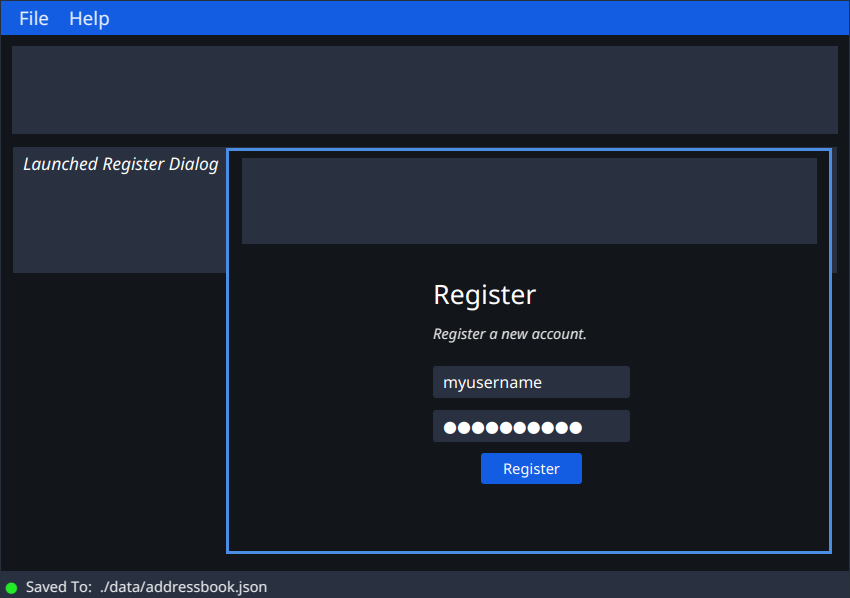

2. In order to log in with this account, enter the command `login` into the command input box. A pop-up similar to
   the following should appear. Enter the username and password from the account you just created in the previous
   step, and click the `Login` button.

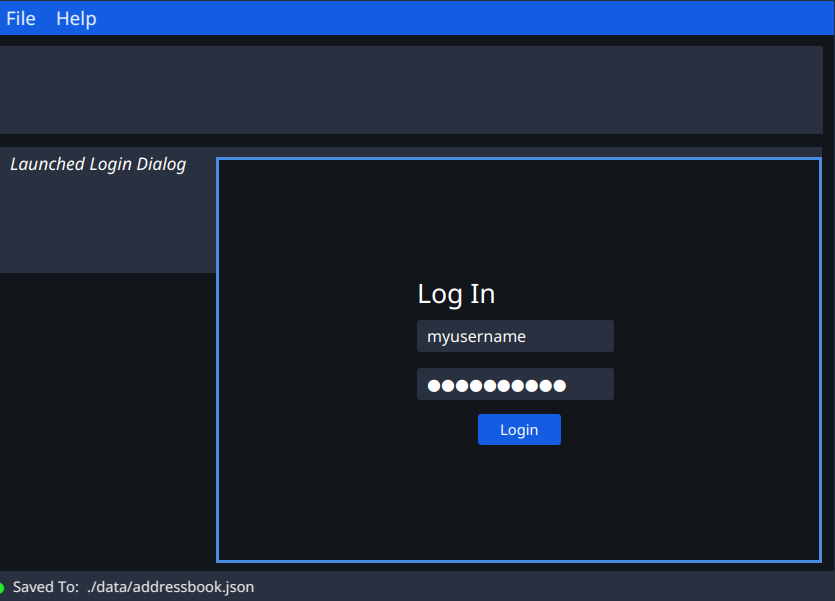

### Learning the DeskFlow UI

After logging in, you will be presented with the following DeskFlow UI. If you're using DeskFlow for the first time
in a newly created home folder, you will see some sample employees (dummy records) in the result table. Familiarize 
yourself with the
various components of the DeskFlow UI.

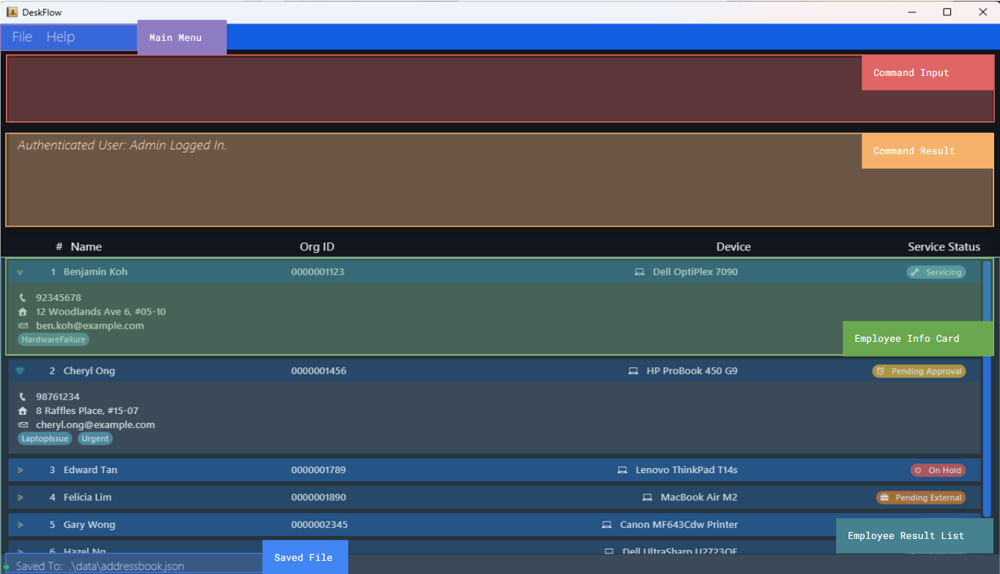

- **Main Menu:** Here, you can conveniently login, access help if you're stuck, or change the file to which the address
  book is saved.
- **Command Input:** This is where you type commands to interact with the address book.
- **Command Result:** When you enter a command, its result will be displayed in this box.
- **Result Table:** When listing or viewing employees, they will be presented in a table here, whereby each column is
  associated with a field in the header.
- **Person Card:** A single employee is represented in a person card, which displays all of their relevant information.
  These cards are collapsed by default.
- **Saved File:** The file that this address book is saved to.

### Learning the DeskFlow CLI

You've already used a few commands to register and log in. Now, let's learn how to use the command line interface
(CLI) to interact with DeskFlow.

Type the command in the command box and press Enter to execute it. e.g. typing **`help`** and pressing Enter will
open the help window. Here are some examples of commands you can try:

- `list`: Lists all employees.
- `add n/John Doe p/98765432 e/johnd@example.com a/311, Clementi Ave 2, #02-25 t/Urgent i/123 d/DeviceInfoXYZ 
st/pending_approval`: Adds an employee named `John Doe` to DeskFlow.
- `delete 3`: Deletes the 3rd employee shown in the current list.
- `set-status 3 st/none`: Sets the status of the 3rd employee to `none`.
- `filter-status st/none`: Filter all employees that have `none` as a status.
- `clear`: Deletes all employees.
- `logout`: Logs out of account.
- `exit`: Exits the app.

Refer to the [Features](#features) below for details of each command.

## Features

This section will describe the features of DeskFlow, starting with the information stored by DeskFlow, and then 
instructions and examples for how to execute each command. Note that if you're unfamiliar with the command format at 
any time, you may refer to the [Command Format](#command-format) section for more details.

### Employee Information Stored by DeskFlow

DeskFlow stores the following information for each employee, however, in order to help ensure that you enter valid 
information, each attribute has its own set of validation rules that must be adhered to when executing commands.

| **Attribute**    | **Validation Rules**                                                                                                                                                                                                                                                                                                             |
|------------------|----------------------------------------------------------------------------------------------------------------------------------------------------------------------------------------------------------------------------------------------------------------------------------------------------------------------------------|
| **Name**         | Only alphanumeric characters, `/`, `'`, `-`, and white spaces allowed.                                                                                                                                                                                                                                                           |
| **Email**        | Must be in the format `local-part@domain`. <br>**Local-part:** Alphanumeric characters and special characters `+`, `_`, `.`, `-` (not starting or ending with special characters). <br>**Domain:** Labels separated by periods; each label must: start and end with alphanumerics, may contain hyphens, and last label ≥ 2 chars. |
| **Phone Number** | Digits only. Length must be > 3 and ≤ 20 digits.                                                                                                                                                                                                                                                                                 |
| **Address**      | Any value allowed **except** those starting with prefixes like `st/`. Cannot be blank.                                                                                                                                                                                                                                           |
| **OrgID**        | Unique numeric value only. Must be ≤ 10 digits. Cannot be blank.                                                                                                                                                                                                                                                                 |
| **Device Info**  | Alphanumeric characters and spaces only. Cannot be blank. Must be ≤ 50 characters.                                                                                                                                                                                                                                               |
| **Tags**         | Alphanumeric characters only. **No white spaces** allowed (e.g., `SoftwareIssue`, `HardwareIssue`, not `Software Issue`).                                                                                                                                                                                                        |
| **Status**       | Must be one of the following: `none`, `pending_approval`, `servicing`, `pending_external`, `on_hold`.                                                                                                                                                                                                                            |

### Command Format

<div markdown="block" class="alert alert-info">:bulb: **Tip:** Reading the Command Format
- Commands are case-sensitive and should all be in small letters.
- Words in `UPPER_CASE` are the parameters to be supplied by the user.<br>
  e.g. in `add n/NAME`, `NAME` is a parameter which can be used as `add n/John Doe`.
- Words in square brackets are optional.<br>
  e.g `n/NAME [t/TAG]` can be used as `n/John Doe t/Urgent` or as `n/John Doe`.
- Items with `…` after them can be added multiple times including zero times.<br>
  e.g. `[t/TAG]…` can be used as ` ` (i.e. 0 times), `t/InternetIssue`, `t/SoftwareIssue t/Urgent` etc.
- Parameters can be in any order.<br>
  e.g. if the command specifies `n/NAME p/PHONE_NUMBER`, `p/PHONE_NUMBER n/NAME` is also acceptable.
- Extraneous parameters for commands that do not take in parameters (such as `help`, `list`, `exit`, `login`, `logout`
  and `clear`) will be ignored.<br>
  e.g. if the command specifies `help 123`, it will be interpreted as `help`.
- If you are using a PDF version of this document, be careful when copying and pasting commands that span multiple lines
  as space characters surrounding line-breaks may be omitted when copied over to the application.
</div>

### Viewing help : `help`

Shows you a message explaining how to access the help page.

Format: `help`

### Logging in : `login`

Opens a Login Dialog where you are prompted to enter your username and password to log in to gain access to DeskFlow
Features.

Format: `login`


<div markdown="block" class="alert alert-info">:clipboard: **Additional Information**
- Deskflow will not grant access to other features until you are logged in.
- Deskflow is a CLI first application where keyboard inputs are optimised, as such you may hit the `Enter` to log in,
after filling in the username and password.
- For first time DeskFlow users, you must `register` an account before logging in.
</div>

### Registering a new account : `register`

Adds credentials for the new DeskFlow user.

Format: `register`

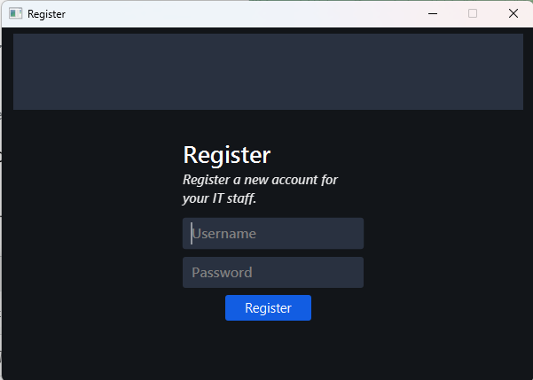

<div markdown="block" class="alert alert-info">:clipboard: **Additional Information**
- You must not have previously registered an account.
- You can only register a single account once, after which you will not be able to register again.
- At this time, once you have registered an account, you cannot change your username or password.
</div>

### Adding an employee : `add`

Adds an employee to DeskFlow.

Format: `add n/NAME p/PHONE_NUMBER e/EMAIL a/ADDRESS [t/TAG]… i/ORGID d/DEVICEINFO st/STATUS`

Examples:

- `add n/John Doe p/98765432 e/johnd@example.com a/311, Clementi Ave 2, #02-25 t/Urgent t/SoftwareIssue i/123 d/DeviceInfoXYZ st/pending_approval`
- `add n/Betsy Crowe t/NetworkIssue e/betsycrowe@example.com a/Newgate Prison p/98752135 i/122 d/DeviceInfoABC st/none`

<div markdown="span" class="alert alert-primary">:bulb: **Tip:**
A person can have any number of tags (including 0)
</div>

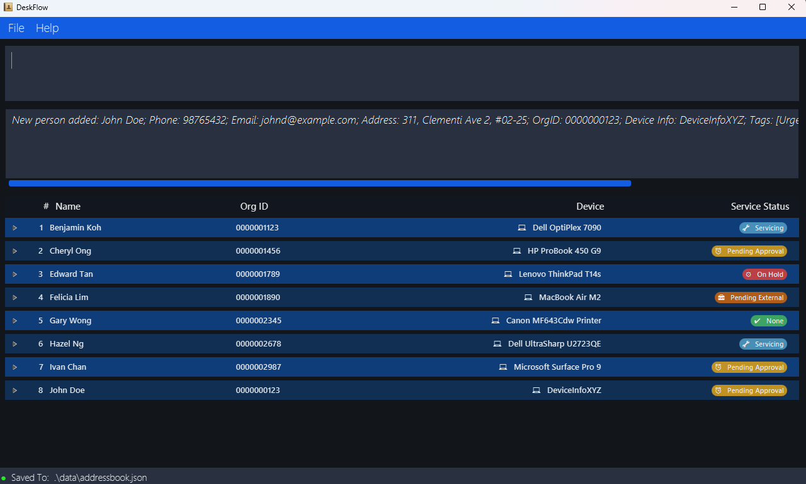

<div markdown="block" class="alert alert-info">:clipboard: **Additional Information**
- Each employee must have a unique organisation ID.
- All attributes are mandatory to be filled in except for tags.
</div>

### Editing an employee's details : `edit`

Edits an existing employee's details in the address book.

Format: `edit INDEX [n/NAME] [p/PHONE] [e/EMAIL] [a/ADDRESS] [t/TAG]… [i/ORGID] [d/DEVICEINFO] [st/STATUS]`

Examples:<br>

- `edit 1 p/91234567 e/johndoe@example.com` edits the phone number and email address of the 1st person to be `91234567`
  and `johndoe@example.com` respectively.
- `edit 2 n/Betsy Crower t/` edits the name of the 2nd person to be `Betsy Crower` and clears all existing tags.

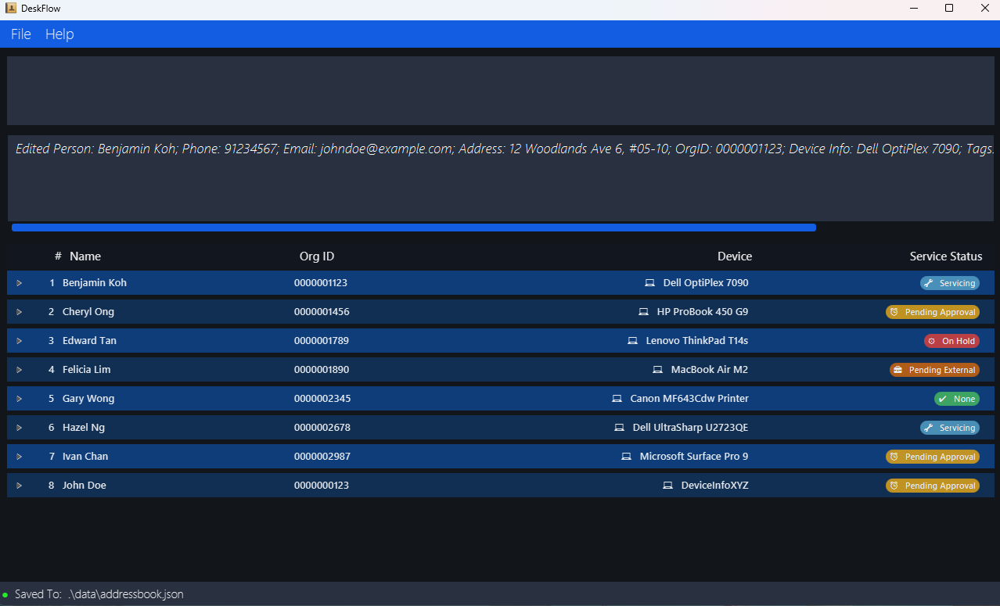

<div markdown="block" class="alert alert-info">:clipboard: **Additional Information**
- Edits the person at the specified INDEX. The index refers to the index number shown in the displayed person list. The
  index must be a positive integer 1, 2, 3, …​
- At least one of the optional fields must be provided.
- Existing values will be updated to the input values.
- When editing tags, the existing tags of the person will be removed i.e adding of tags is not cumulative.
- You can remove all the person’s tags by typing t/ without specifying any tags after it.
</div>

### Listing all employees : `list`

Shows a list of all employees in the organization recorded in DeskFlow.

Format: `list`

### Set an employee's status : `set-status`

Sets an existing employee's current status to the provided status.

Format: `set-status INDEX st/STATUS`

Examples:

- `set-status 1 st/pending_approval` sets the status for the 1st person in the list shown currently listed
  to `pending_approval`.

### Filter by status : `filter-status`

Format: `filter-status st/STATUS`

Examples:

- `filter-status st/pending_approval` gets all employees with status of `pending_approval`.

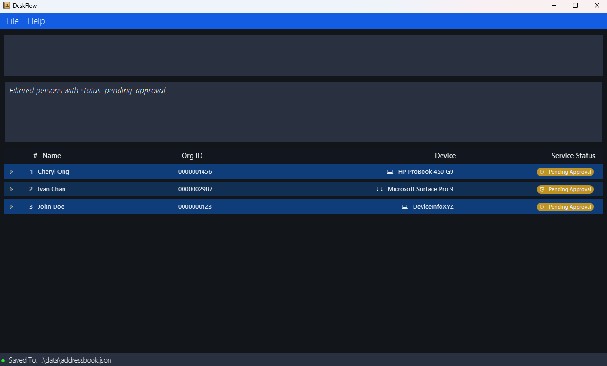

### Locating employee by name : `find`

Finds employees whose names contain any of the given keywords.

Format: `find KEYWORD [MORE_KEYWORDS]`

Examples:

- `find John` lists employees with name containing `john` like `John Doe`
- `find alex david` lists employees with name containing `alex` and `david` like `Alex Yeoh`, `David Li`

<div markdown="block" class="alert alert-info">:clipboard: **Additional Information**
- `find` is case-insensitive. (i.e. `hans` will match `Hans`)
- The order of the keywords does not matter. (i.e. `Hans Bo` will match `Bo Hans`)
- Only full words will be matched. (i.e. `Han` will not match `Hans`)
- Employees whose names matching at least one keyword will be listed.
  e.g. `Hans Bo` will list `Hans Gruber`, `Bo Yang`
</div>

### Locating employees by any attribute : `findby`

Finds employees for which any of the specified attributes contains the specified keyword / search term.

Format: `findby [n/NAME_KEYWORD] [p/PHONE_KEYWORD] [e/EMAIL_KEYWORD] [a/ADDRESS_KEYWORD] 
[t/TAG_KEYWORD]… [i/ORGID_KEYWORD] 
[d/DEVICEINFO_KEYWORD] 
[st/STATUS_KEYWORD]`

Examples:

- `findby n/alex st/pending_external` lists all employees that either contain name `alex` or the status
  `pending_external`.
- `findby a/jurong st/pending_approval` lists all employees with an address containing `jurong` or the status
  `pending_approval`.

<div markdown="block" class="alert alert-info">:clipboard: **Additional Information**
- The order of specifying attributes does not matter, so the query `findby n/jon st/none` will be equivalent to
  `findby st/none n/jon`.
- If multiple attributes are given, employees that contain the keyword in any of the corresponding attribute will be
  listed.
- For each attribute, the search is case-insensitive, and the entire keyword / search term will be partially matched
  inside the attribute. So, for example, searching `findby a/ blk123` will show an employee with the address `Blk123`.
- For each attribute, the keyword / search term will be partially matched inside the attribute, and can contain
  spaces. For example, searching `findby n/ alex yeoh` will show an employee with the name `Alex Yeoh Tan Wei`.
- In a single attribute all keywords will be considered as one. (i.e. `H n` will not match `Hans` or `Han`).
- Special symbols will not be filtered before and after keywords.
</div>

### Deleting an employee : `delete`

Deletes the specified person from the address book.

Format: `delete INDEX`

<div markdown="span" class="alert alert-warning">:exclamation: **Caution:**
This action is irreversible. The deleted person will be removed from the address book and cannot be recovered.
</div>

<div markdown="block" class="alert alert-info">:clipboard: **Additional Information**
- Deletes the person at the specified `INDEX`.
- The index refers to the index number shown in the displayed person list.
- The index **must be a positive integer** 1, 2, 3, ….
</div>

Additional Information:


### Clearing all entries : `clear`

Clears all entries from the address book.

Format: `clear`

<div markdown="span" class="alert alert-warning">:exclamation: **Caution:**
This action is irreversible. The deleted person will be removed from the address book and cannot be recovered.
</div>

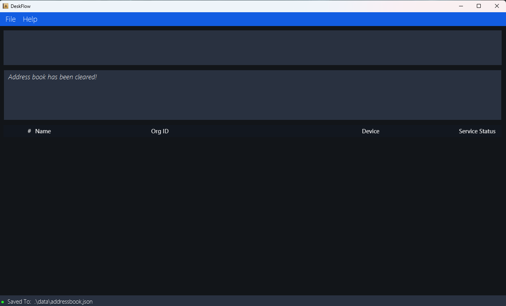

### Logging out : `logout`

Logs the user out.

Format: `logout`

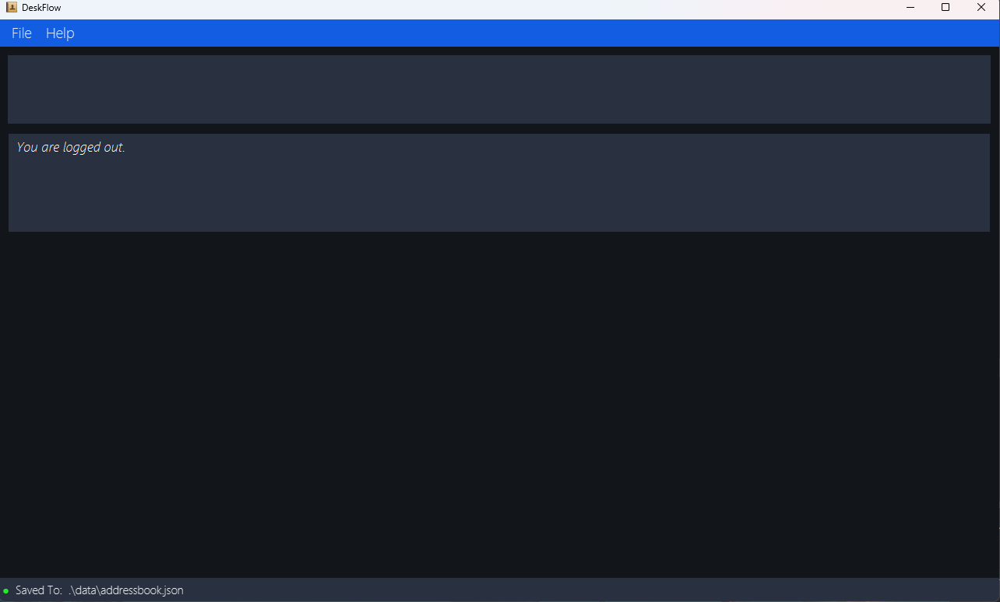

### Exiting the program : `exit`

Exits the program.

Format: `exit`

### Importing data : `import`

AddressBook data can be imported from an existing AddressBook JSON file.

Format: `import PATH`

Example:

- `import data\import.json` **replaces** existing data with the imported JSON.

<div markdown="span" class="alert alert-warning">:exclamation: **Caution:**
Importing a new data file will completely replace the existing address book. Hence, you are recommended to make a backup of the file before importing.
</div>

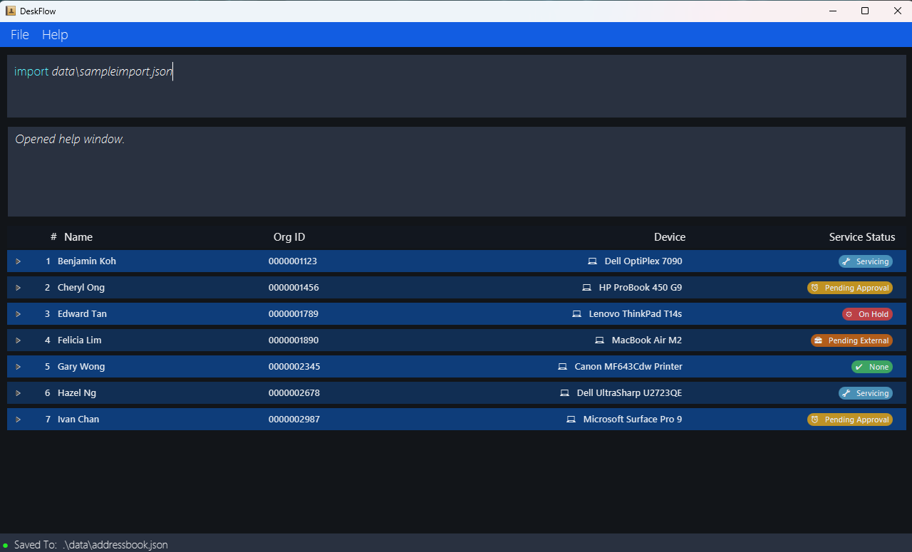

- You should see a success message after successfully importing.

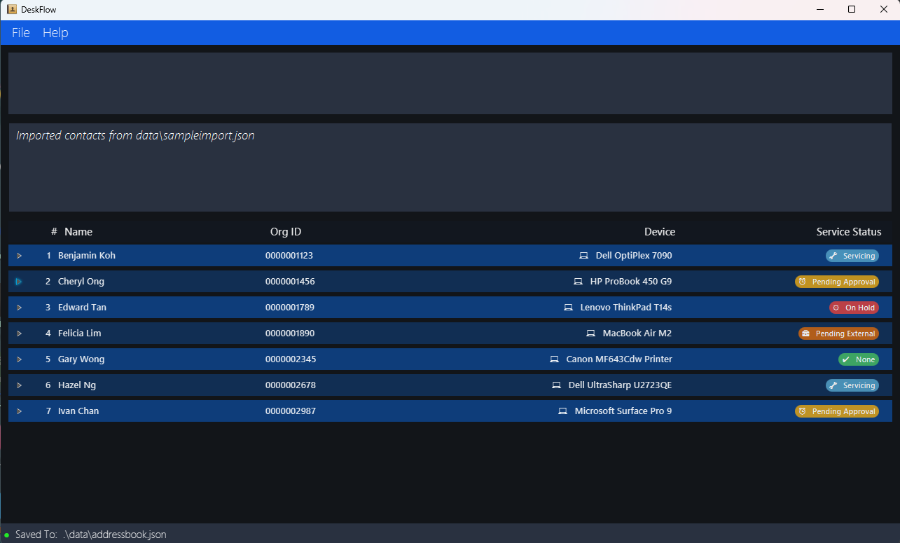

<div markdown="block" class="alert alert-info">:clipboard: **Additional Information**
- You can use either relative (`data/imported_AB.json`) or absolute
  path (`C:\Users\keega\Documents\tp\data\import.json`).
- You should use the pathing convention that matches your Operating System for better results.
- The import function is meant to replace the existing AddressBook data and not for exporting to a new JSON file.
</div>

### Saving data

Your DeskFlow data is saved in the hard disk automatically after any command that changes the data. There is no need for
you to save
manually. You can see where the data is stored at the bottom of the DeskFlow window.

### Editing data file

Your DeskFlow data is saved automatically as a JSON file `[JAR file location]/data/addressbook.json`. Advanced users are
welcome to update data directly by editing that data file.

<div markdown="span" class="alert alert-warning">:exclamation: **Caution:**
If your changes to the data file makes its format invalid, DeskFlow will discard all data and start with an empty data file at the next run. Hence, it is recommended to make a backup of the file before editing it.<br>
Furthermore, certain edits can cause DeskFlow to behave in unexpected ways (e.g., if a value entered is outside of the acceptable range). Therefore, edit the data file only if you are confident that you can update it correctly.
</div>

## FAQ

**Q**: How do I transfer my data to another computer?<br>
**A**:
You should install DeskFlow on the other computer and overwrite the empty JSON data file with the JSON file of your
previous DeskFlow application.
You can find your previous JSON file in the home folder.

**Q**: Is there a way to undo an accidental employee deletion?<br>
**A**:
Unfortunately you cannot undo an accidental employee deletion, but it is possible to add the employee back again.

**Q**: Who has access to employee data?<br>
**A**:
Only users that are logged in can access and read the employee data.

## Known issues

1. **When using multiple screens**, if you move the application to a secondary screen, and later switch to using only
   the primary screen, the GUI will open off-screen. The remedy is to delete the `preferences.json` file created by the
   application before running the application again.
2. **If you minimize any of the Pop-Up Help/Login/Register Windows** and then run the `help/login/register` command (or
   use the corresponding menu buttons or keyboard shortcuts) again, the original Window will remain minimized, and
   no new window will appear. The remedy is to manually restore the minimized window in your operating system.
3. **You might not see icons rendering correctly** depending on your Operating System or the fonts you have installed.
   We are working on allowing icons to be universally visible.

## Command summary

| Action            | Format, Examples                                                                                                                                                                                                                                     |
|-------------------|------------------------------------------------------------------------------------------------------------------------------------------------------------------------------------------------------------------------------------------------------|
| **Add**           | `add n/NAME p/PHONE_NUMBER e/EMAIL a/ADDRESS i/ORGID d/DEVICEINFO st/STATUS [t/TAG]… `<br/>e.g., `add n/John Doe p/98765432 e/johnd@example.com a/311, Clementi Ave 2, #02-25 i/000123 d/DeviceInfoXYZ st/pending_approval t/Urgent t/SoftwareIssue` |
| **Delete**        | `delete INDEX`<br> e.g., `delete 3`                                                                                                                                                                                                                  |
| **Edit**          | `edit INDEX [n/NAME] [p/PHONE_NUMBER] [e/EMAIL] [a/ADDRESS] [t/TAG]… [i/ORGID] [d/DEVICEINFO] [st/STATUS]`<br> e.g.,`edit 2 n/James Lee e/jameslee@example.com`                                                                                      |
| **Find**          | `find KEYWORD [MORE_KEYWORDS]`<br> e.g., `find James Jake`                                                                                                                                                                                           |
| **Find By**       | `findby [n/NAME_KEYWORD] [p/PHONE_KEYWORD] [e/EMAIL_KEYWORD] [a/ADDRESS_KEYWORD] [t/TAG_KEYWORD]… [i/ORGID_KEYWORD] [d/DEVICEINFO_KEYWORD] [st/STATUS_KEYWORD]` <br> e.g., `findby n/James Jake st/none`                                             |
| **Set Status**    | `set-status INDEX st/STATUS` <br> e.g., `set-status 1 st/none`                                                                                                                                                                                       |
| **Filter Status** | `filter-status st/STATUS`   <br> e.g., `filter-status st/none`                                                                                                                                                                                       |
| **Import**        | `import PATH`         <br> e.g., `import data/imported_AB.json`                                                                                                                                                                                      |
| **List**          | `list`                                                                                                                                                                                                                                               |
| **Help**          | `help`                                                                                                                                                                                                                                               |
| **Login**         | `login`                                                                                                                                                                                                                                              |
| **Logout**        | `logout`                                                                                                                                                                                                                                             |
| **Register**      | `register`                                                                                                                                                                                                                                           |
| **Clear**         | `clear`                                                                                                                                                                                                                                              |

